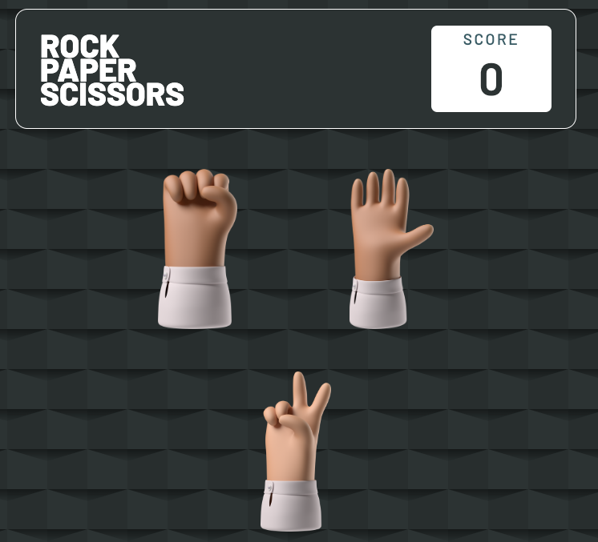

## Table of contents

- [Overview](#overview)
  - [Screenshot](#screenshot)
  - [Links](#links)
- [My process](#my-process)
  - [Built with](#built-with)
  - [What I learned](#what-i-learned)
  - [Continued development](#continued-development)
- [Author](#author)


## Overview

### Screenshot



### Links

- Netlify Site : (https://rock-paper-scissors-bydcast.netlify.app/)
- Github Site: (https://iamdcast.github.io/Rock-Paper-Scissors/)


### Built with

- Semantic HTML5 markup
- CSS custom properties
- CSS Grid
- JS 

### What I learned

I used more CSS animations from Animate.style. I will start using more for my projects.


```css
.hands img:hover{
filter: drop-shadow(0 0 0.75rem #E7F6F2);
animation-name: tada;
animation-duration: 1.5s;
animation-timing-function: ease-in-out;
}
```

### Continued development

Continue more projects


## Author

- Frontend Mentor - [@iamdcast](https://www.frontendmentor.io/profile/iamdcast)
- Twitter - [@iamdcast](https://www.twitter.com/iamdcast)


